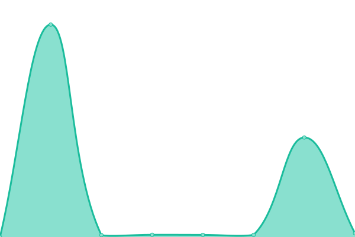
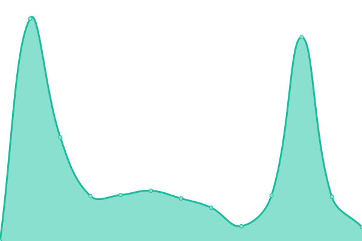

# [📈 Live Status](https://FabrizioSulcaR.github.io/monitoring_ms): <!--live status--> **🟧 Partial outage**

This repository contains the open-source uptime monitor and status page for [FabrizioSulcaR](https://FabrizioSulcaR.github.io/monitoring_ms), powered by [Upptime](https://github.com/upptime/upptime).

With [Upptime](https://upptime.js.org), you can get your own unlimited and free uptime monitor and status page, powered entirely by a GitHub repository. We use [Issues](https://github.com/FabrizioSulcaR/monitoring_ms/issues) as incident reports, [Actions](https://github.com/FabrizioSulcaR/monitoring_ms/actions) as uptime monitors, and [Pages](https://FabrizioSulcaR.github.io/monitoring_ms) for the status page.

<!--start: status pages-->
<!-- This summary is generated by Upptime (https://github.com/upptime/upptime) -->
<!-- Do not edit this manually, your changes will be overwritten -->
<!-- prettier-ignore -->
| URL | Status | History | Response Time | Uptime |
| --- | ------ | ------- | ------------- | ------ |
|  [ETDLP-Landing](https://etdlp.softr.app/) | 🟩 Up | [etdlp-landing.yml](https://github.com/FabrizioSulcaR/monitoring_ms/commits/HEAD/history/etdlp-landing.yml) | 

 918ms
     
 | 

<a href="https://FabrizioSulcaR.github.io/monitoring_ms/history/etdlp-landing">100.00%</a>
    

|  ETDLP-MMicroservices | 🟩 Up | [etdlp-m-microservices.yml](https://github.com/FabrizioSulcaR/monitoring_ms/commits/HEAD/history/etdlp-m-microservices.yml) | 

 870ms
     
 | 

<a href="https://FabrizioSulcaR.github.io/monitoring_ms/history/etdlp-m-microservices">100.00%</a>
    

|  ETDLP-MsPresidencia | 🟩 Up | [etdlp-ms-presidencia.yml](https://github.com/FabrizioSulcaR/monitoring_ms/commits/HEAD/history/etdlp-ms-presidencia.yml) | 

 1702ms
     
 | 

<a href="https://FabrizioSulcaR.github.io/monitoring_ms/history/etdlp-ms-presidencia">100.00%</a>
    

|  ETDLP-MsCongreso | 🟩 Up | [etdlp-ms-congreso.yml](https://github.com/FabrizioSulcaR/monitoring_ms/commits/HEAD/history/etdlp-ms-congreso.yml) | 

 1899ms
     
 | 

<a href="https://FabrizioSulcaR.github.io/monitoring_ms/history/etdlp-ms-congreso">100.00%</a>
    

|  ETDLP-MsMinisterios | 🟩 Up | [etdlp-ms-ministerios.yml](https://github.com/FabrizioSulcaR/monitoring_ms/commits/HEAD/history/etdlp-ms-ministerios.yml) | 

 23567ms
     
 | 

<a href="https://FabrizioSulcaR.github.io/monitoring_ms/history/etdlp-ms-ministerios">79.49%</a>
    

|  ETDLP-MsMINSA | 🟩 Up | [etdlp-ms-minsa.yml](https://github.com/FabrizioSulcaR/monitoring_ms/commits/HEAD/history/etdlp-ms-minsa.yml) | 

 18547ms
     
 | 

<a href="https://FabrizioSulcaR.github.io/monitoring_ms/history/etdlp-ms-minsa">98.07%</a>
    

|  ETDLP-MsMININTER | 🟥 Down | [etdlp-ms-mininter.yml](https://github.com/FabrizioSulcaR/monitoring_ms/commits/HEAD/history/etdlp-ms-mininter.yml) | 

 0ms
     
 | 

<a href="https://FabrizioSulcaR.github.io/monitoring_ms/history/etdlp-ms-mininter">0.00%</a>
    

|  ETDLP-MsMINDEF | 🟩 Up | [etdlp-ms-mindef.yml](https://github.com/FabrizioSulcaR/monitoring_ms/commits/HEAD/history/etdlp-ms-mindef.yml) | 

 1077ms
     
 | 

<a href="https://FabrizioSulcaR.github.io/monitoring_ms/history/etdlp-ms-mindef">100.00%</a>
    

|  ETDLP-ROP | 🟩 Up | [etdlp-rop.yml](https://github.com/FabrizioSulcaR/monitoring_ms/commits/HEAD/history/etdlp-rop.yml) | 

 21908ms
     
 | 

<a href="https://FabrizioSulcaR.github.io/monitoring_ms/history/etdlp-rop">100.00%</a>
    

|  ETDLP_INFOPROVEEDORES | 🟩 Up | [etdlp-infoproveedores.yml](https://github.com/FabrizioSulcaR/monitoring_ms/commits/HEAD/history/etdlp-infoproveedores.yml) | 

 8983ms
     
 | 

<a href="https://FabrizioSulcaR.github.io/monitoring_ms/history/etdlp-infoproveedores">96.42%</a>
    

<!--end: status pages-->

[**Visit our status website →**](https://FabrizioSulcaR.github.io/monitoring_ms)

## 📄 License

- Powered by: [Upptime](https://github.com/upptime/upptime)
- Code: [MIT](./LICENSE) © [FabrizioSulcaR](https://FabrizioSulcaR.github.io/monitoring_ms)
- Data in the `./history` directory: [Open Database License](https://opendatacommons.org/licenses/odbl/1-0/)
